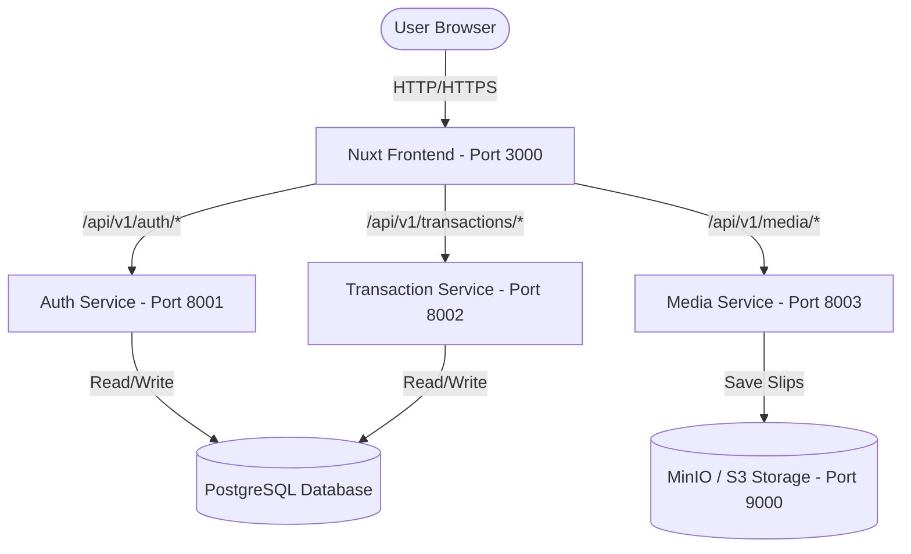

# System Architecture Overview: นับตังค์ (Nap-Tang)

นับตังค์ (Nap-Tang) is designed using a Microservices Architecture on the backend with a Nuxt 4 frontend. The services are containerized using Docker and managed via Docker Compose.



## 1. Network & Port Assignments

To facilitate local development and container communication, we define the following ports and services:

| Service Name | Port | Status | Description |
| :--- | :--- | :--- | :--- |
| **Nuxt Frontend** | `3000` | **Running** | User Interface (Vite + Nuxt 4) |
| **AuthService** | `8001` | **Running** | Manages user registration, JWT token generation, & login |
| **TransactionService**| `8002` | **Running** | Manages income/expense CRUD, categories, & analytics |
| **MediaService** | `8003` | **Running** | Manages slip upload to Object Storage (MinIO/S3) |
| **PostgreSQL** | `5432` | **Running** | Relational database (schema `easytrack_auth` and `easytrack_transactions`) |
| **MinIO (API)** | `9000` | **Running** | S3-compatible object storage server |
| **MinIO (Console)** | `9001` | **Running** | MinIO web management console |

---

## 2. Backend Design Pattern
Each microservice is structured using clean architecture principles and MVC Web API pattern:
* **Domain & Entities:** Built utilizing EF Core code-first mappings.
* **Infrastructure:** Database Contexts, Password Hashers, JWT Token Rotation, and AWS S3 Clients.
* **Controllers:** Standard Web API controllers exposing RESTful APIs.

---

## 3. Database Schema Layout
We use a single PostgreSQL instance with separate database schemas to ensure microservice boundary decoupling:
* `easytrack_auth`: Tables for Users and Refresh Tokens.
* `easytrack_transactions`: Tables for Transactions and Categories (with 8 default categories seeded).

---

## 4. Run & Development Commands
To start/run the microservices and frontend web app:
* **Option A: Full Orchestration (Run everything in Docker):**
  ```bash
  docker-compose up --build -d
  ```
* **Option B: Hybrid Development (Run DBs in Docker, Services locally):**
  * **Databases & Storage:**
    ```bash
    docker-compose up -d db object-storage
    ```
  * **AuthService:**
    ```bash
    dotnet run --project backend/src/Services/AuthService/EasyTrack.AuthService.csproj --launch-profile http
    ```
  * **TransactionService:**
    ```bash
    dotnet run --project backend/src/Services/TransactionService/EasyTrack.TransactionService.csproj --launch-profile http
    ```
  * **MediaService:**
    ```bash
    dotnet run --project backend/src/Services/MediaService/EasyTrack.MediaService.csproj --launch-profile http
    ```
  * **Nuxt Frontend:**
    ```bash
    cd frontend
    $env:NUXT_TELEMETRY_DISABLED=1; npm run dev
    ```

---

## 5. UI Design Theme
The user interface is styled using a custom, cute cartoon-inspired theme with a blue and pink pastel color scheme:
* **Typography:** Google Fonts Fredoka (for bold, rounded headings) and Nunito (for readable body text).
* **Color Palette:** Cotton candy gradient (from Sky Blue `#4EA8DE` to Rose Pink `#FF85A1`), background pastel blend (Alice Cream/Lavender blush), and bright accent markers.
* **Component Styling:** Curved shapes (`rounded-3xl` / `rounded-[1.8rem]`), soft custom pink drop shadows, and active bouncy scale hover animations on buttons.

---

## 6. Git Branching Strategy
We maintain separate environments using branches:
* **`main` Branch:** Stores stable, production-ready code. Commits here represent live application state.
* **`develop` Branch:** Active development branch. New features and hotfixes are merged here for testing before release.

